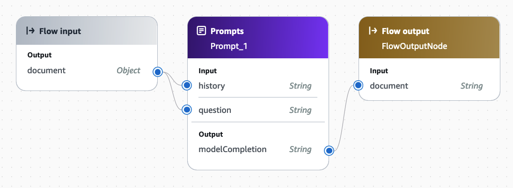
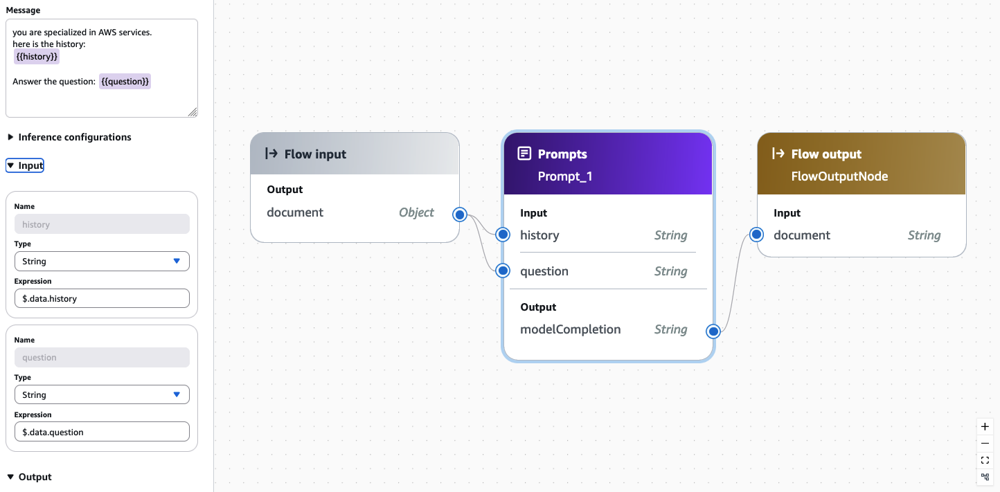

# BedrockFlowsAgent Example

This example demonstrates how to use the **[BedrockFlowsAgent](https://awslabs.github.io/multi-agent-orchestrator/agents/built-in/bedrock-flows-agent/)** for direct agent invocation, avoiding the multi-agent orchestration when you only need a single specialized agent.

## Direct Agent Usage
Call your agent directly using:

Python:
```python
response = await orchestrator.agent_process_request(
    user_input,
    user_id,
    session_id,
    classifier_result
)
```

TypeScript:
```typescript
const response = await orchestrator.agentProcessRequest(
    userInput,
    userId,
    sessionId,
    classifierResult
)
```

This approach leverages the BedrockFlowsAgent's capabilities:
- Conversation history management
- Bedrock Flow integration
- Custom input/output encoding

### Tech Agent Flow Configuration
The example flow connects:
- Input node → Prompt node → Output node

The prompt node accepts:
- question (current question)
- history (previous conversation)




📝 **Note**  
📅 As of December 2, 2024, Bedrock Flows does not include built-in memory management.

See the code samples above for complete implementation details.

---
*Note: For multi-agent scenarios, add your agents to the orchestrator and use `orchestrator.route_request` (Python) or `orchestrator.routeRequest` (TypeScript) to enable classifier-based routing.*