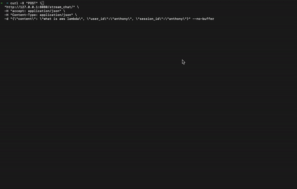

# Multi-Agent Orchestrator with Fast-api

This project implements a FastAPI-based web service that uses a Multi-Agent Orchestrator to process and respond to user queries. It supports streaming responses and uses AWS Bedrock for language model interactions.

## Installation

1. Clone this repository:
   ```bash
   git clone https://github.com/awslabs/multi-agent-orchestrator.git
   cd examples/fast-api-streaming
   ```

2. Install the required dependencies (must be done with python3.12):
   ```bash
   python -m venv .venv
   source .venv/bin/activate
   pip install -r requirements.txt
   ```

## Configuration

Before running the application, make sure to set up your AWS credentials and region. You can do this by setting environment variables or using AWS CLI's `aws configure` command.

## Running the Application

To start the server, run:

```
python -m uvicorn main:app --port 8080
```

This will start the FastAPI server on `http://127.0.0.1:8080`.

## Usage

You can interact with the API using curl or any HTTP client. Here's an example using curl:

```bash
curl -X "POST" \
     "http://127.0.0.1:8080/stream_chat/" \
     -H "accept: application/json" \
     -H "Content-Type: application/json" \
     -d "{\"content\": \"what is aws lambda\", \"user_id\":\"01234\", \"session_id\":\"012345\"}" \
     --no-buffer
```

This will send a streaming request to the `/stream_chat/` endpoint with the given query.

## Demo




## API Endpoints

- POST `/stream_chat/`: Accepts a JSON payload with `content`, `user_id`, and `session_id`. Returns a streaming response with the generated content.

## Project Structure

- `main.py`: The main FastAPI application file containing the API routes and Multi-Agent Orchestrator setup.
- `requirements.txt`: List of Python dependencies for the project.

## Notes

- This application uses AWS Bedrock for language model interactions. Ensure you have the necessary permissions and credentials set up.
- The Multi-Agent Orchestrator is configured with a Tech Agent and a Health Agent.
- Streaming responses are implemented for real-time output.