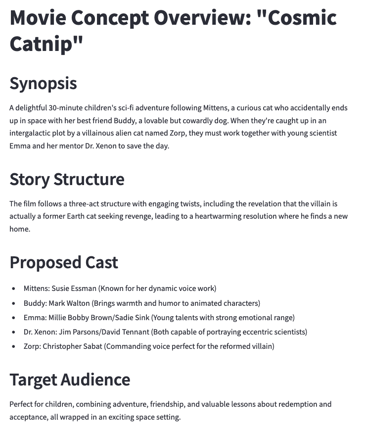

## 🎬 AI Movie Production Agent
This Streamlit app is an AI-powered movie production assistant that helps bring your movie ideas to life using Claude 3 on Amazon BedrocK. It automates the process of script writing and casting, allowing you to create compelling movie concepts with ease.




### Features
- Generates script outlines based on your movie idea, genre, and target audience
- Suggests suitable actors for main roles, considering their past performances and current availability
- Provides a concise movie concept overview

### How to get Started?

1. Clone the GitHub repository

```bash
git clone https://github.com/awslabs/multi-agent-orchestrator.git
```
2. Install the required dependencies:

```bash
cd examples/movie-production
pip install -r requirements.txt
```
3. Get your AWS Credentials

4. Run the Streamlit App
```bash
streamlit run movie-production-demo.py
```

### How it Works?

The AI Movie Production Agent utilizes three main components:
- **ScriptWriterAgent**: Develops a compelling script outline with character descriptions and key plot points based on the given movie idea and genre.
- **CastingDirectorAgent**: Suggests suitable actors for the main roles, considering their past performances and current availability by making web search using a tool.
- **MovieProducerAgent**: Oversees the entire process, coordinating between the ScriptWriter and CastingDirector, and providing a concise movie concept overview.