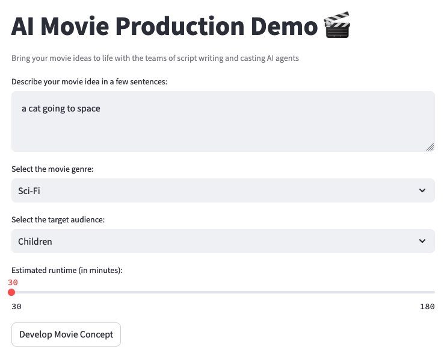

## 🎬 AI Movie Production Agent
This Streamlit app is an AI-powered movie production assistant that helps bring your movie ideas to life using Claude 3 on Amazon Bedrock. It automates the process of script writing and casting, allowing you to create compelling movie concepts with ease.

### Streamlit App
Here is a screenshot of the streamlit app. You can describe your movie, select a movie genre, audience and duration and hit `Develop Movie Concept`

After a few seconds you should have your movie ready! 🍿 🎬

### Features
- Generates script outlines based on your movie idea, genre, and target audience
- Suggests suitable actors for main roles, considering their past performances and current availability
- Provides a concise movie concept overview

### How to Get Started?

Check out the [demos README](../README.md) for installation and setup instructions.

### How it Works?

The AI Movie Production Agent utilizes three main components:
- **ScriptWriterAgent**: Develops a compelling script outline with character descriptions and key plot points based on the given movie idea and genre.
- **CastingDirectorAgent**: Suggests suitable actors for the main roles, considering their past performances and current availability by making web search using a tool.
- **MovieProducerAgent**: Oversees the entire process, coordinating between the ScriptWriter and CastingDirector, and providing a concise movie concept overview.