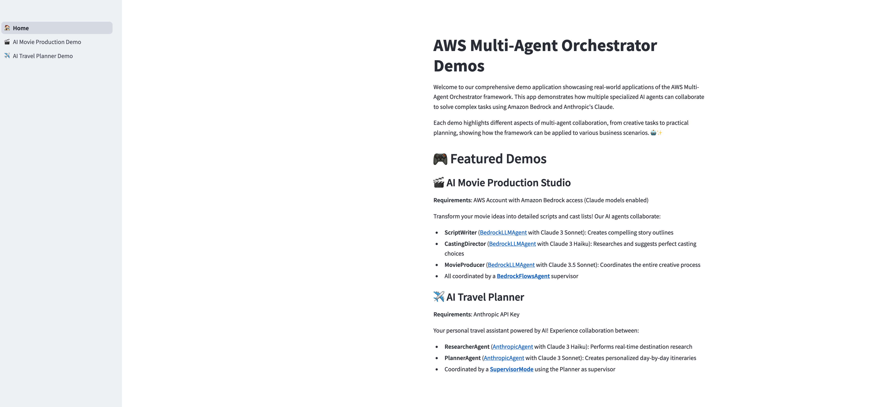

# AWS Multi-Agent Orchestrator Demos

This Streamlit application demonstrates the capabilities of the AWS Multi-Agent Orchestrator framework by showcasing how specialized AI agents can collaborate to solve complex tasks using Amazon Bedrock and Anthropic's Claude models.



## 🎯 Current Demos

### 🎬 [AI Movie Production](../movie-production/README.md)
**Requirements**: AWS Account with Amazon Bedrock access (Claude models enabled)

Bring your movie ideas to life with this AI-powered production assistant. Describe your movie concept, select a genre and target audience, and let the system create a comprehensive script outline and recommend actors for the main roles based on real-time research.

### ✈️ [AI Travel Planner](../travel-planner/README.md)
**Requirements**: Anthropic API Key

Enter your destination and travel duration, and the system will research attractions, accommodations, and activities in real-time to create a personalized, day-by-day itinerary based on your preferences.


## 🚀 Getting Started

### Prerequisites
- Python 3.8 or higher
- For Movie Production Demo:
  - AWS account with access to Amazon Bedrock
  - AWS credentials configured ([How to configure AWS credentials](https://docs.aws.amazon.com/cli/latest/userguide/cli-configure-files.html))
  - Claude models enabled in Amazon Bedrock ([Enable Bedrock model access](https://docs.aws.amazon.com/bedrock/latest/userguide/model-access.html))
- For Travel Planner Demo:
  - Anthropic API Key ([Get your API key](https://console.anthropic.com/account/keys))

### Installation

1. Clone the repository:
```bash
git clone https://github.com/awslabs/multi-agent-orchestrator.git
cd examples/python
python -m venv venv
source venv/bin/activate # On Windows use `venv\Scripts\activate`
pip install -r requirements.txt
```

4. Configure AWS credentials:
   - Follow the [AWS documentation](https://docs.aws.amazon.com/cli/latest/userguide/cli-configure-files.html) to set up your credentials using your preferred method (AWS CLI, environment variables, or credentials file)

5. Run the Streamlit app:
```bash
streamlit run main-app.py
```

## 🎮 Featured Demos

### 🎬 AI Movie Production Studio
**Prerequisite**: AWS Account with Amazon Bedrock access (Claude models enabled)

Transform your movie ideas into detailed scripts and cast lists! Our AI agents collaborate:
- **ScriptWriter** ([BedrockLLMAgent](https://awslabs.github.io/multi-agent-orchestrator/agents/built-in/bedrock-llm-agent) with Claude 3 Sonnet): Creates compelling story outlines
- **CastingDirector** ([BedrockLLMAgent](https://awslabs.github.io/multi-agent-orchestrator/agents/built-in/bedrock-llm-agent) with Claude 3 Haiku): Researches and suggests perfect casting choices
- **MovieProducer** ([BedrockLLMAgent](https://awslabs.github.io/multi-agent-orchestrator/agents/built-in/bedrock-llm-agent) with Claude 3.5 Sonnet): Coordinates the entire creative process
- All coordinated by a  [**Custom Agent**](https://awslabs.github.io/multi-agent-orchestrator/agents/custom-agents)  as Supervisor Agent

### ✈️ AI Travel Planner
**Prerequisite**: Anthropic API Key

Your personal travel assistant powered by AI! Experience collaboration between:
- **ResearcherAgent** ([AnthropicAgent](https://awslabs.github.io/multi-agent-orchestrator/agents/built-in/anthropic-agent) with Claude 3 Haiku): Performs real-time destination research
- **PlannerAgent** ([AnthropicAgent](https://awslabs.github.io/multi-agent-orchestrator/agents/built-in/anthropic-agent) with Claude 3 Sonnet): Creates personalized day-by-day itineraries
- Coordinated by a [**Custom Agent**](https://awslabs.github.io/multi-agent-orchestrator/agents/custom-agents) as Supervisor Agent

## 🛠️ Technologies Used
- Streamlit for UI
- AWS Multi-Agent Orchestrator for multi-agent collaboration
- Amazon Bedrock for deploying Claude models
- Anthropic's Claude models for AI reasoning
- Python for backend scripting

## 📚 Documentation


Learn more about the AWS Multi-Agent Orchestrator framework, including its features and technical details, by visiting the official [documentation](https://awslabs.github.io/multi-agent-orchestrator/).


## 🤝 Contributing

If you want to create a new demo to be included in this global Streamlit demo application, contributions are welcome! Please fork the repository, create a new branch with your changes, and submit a Pull Request for review